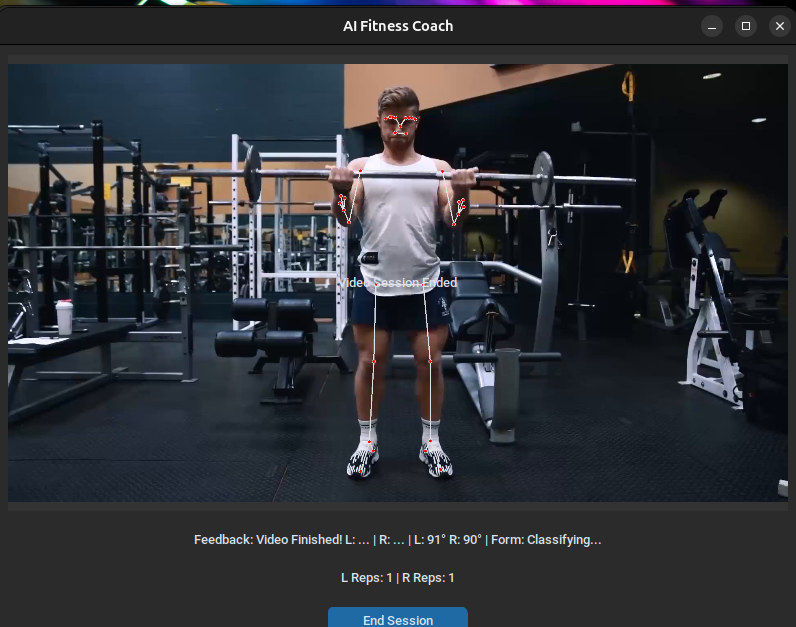
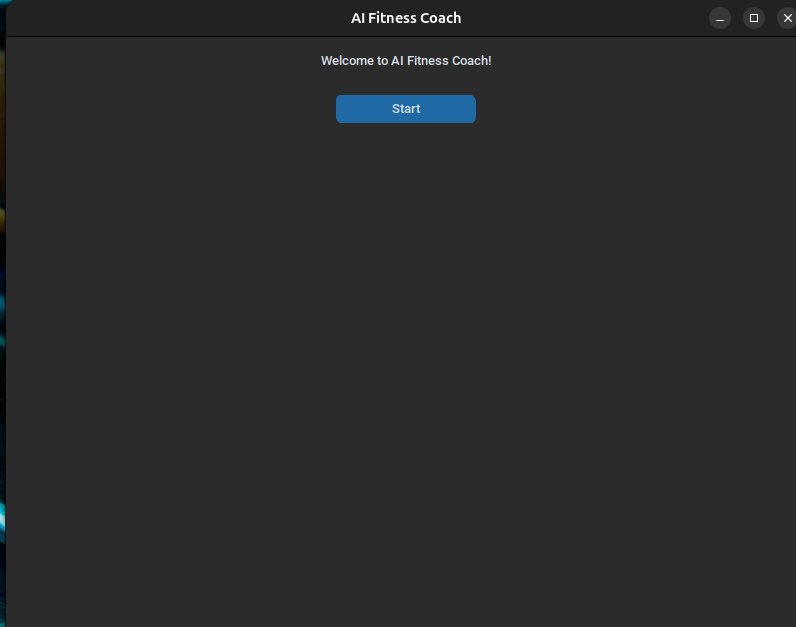
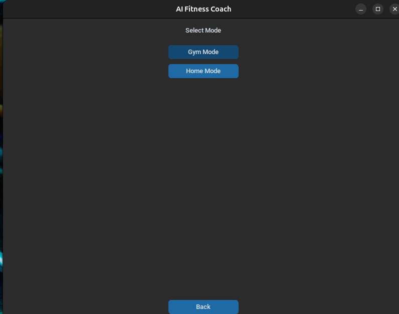
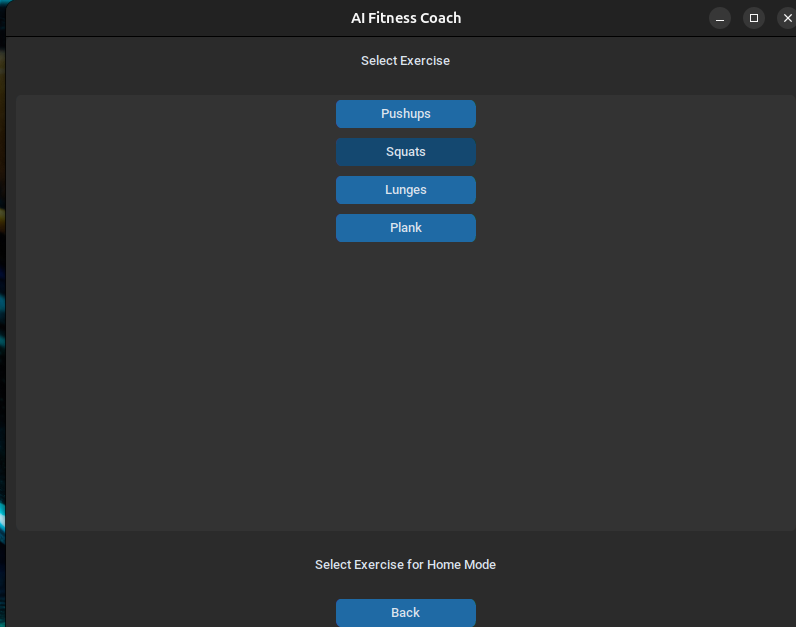
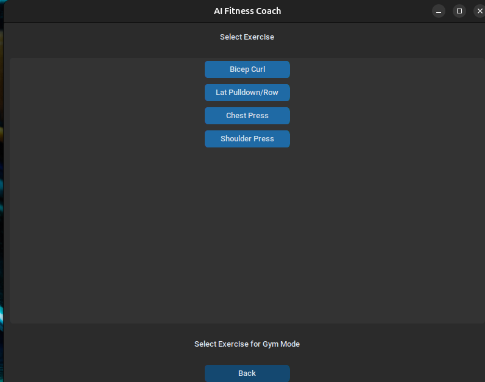
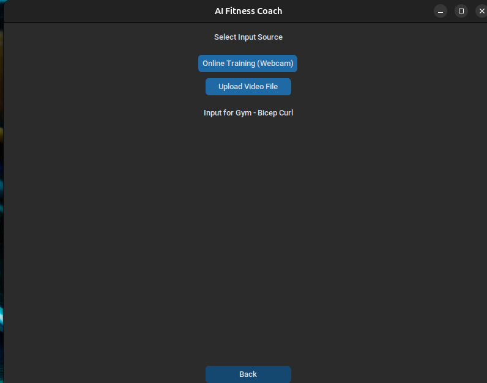
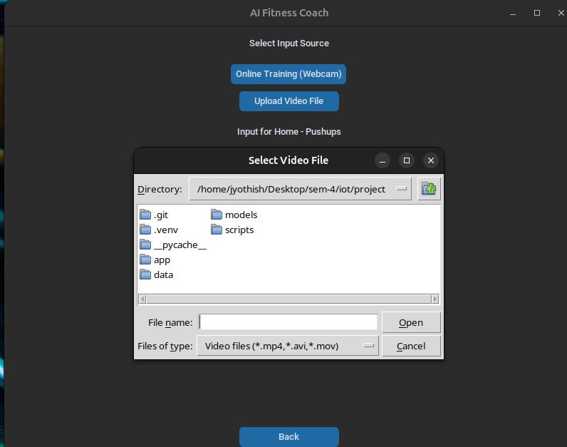

# 🏋️ AI Fitness Coach

An AI-powered real-time fitness coach that detects and corrects your exercise posture using computer vision and deep learning. Built with MediaPipe, LSTM neural networks, TensorFlow, and OpenCV.

---

## 🔴 Live Detection Preview


*Real-time MediaPipe skeleton overlay with joint angle tracking and rep counting*

---

## 🚀 Features

- 🏠 **Home Mode** — Bodyweight exercises without equipment
- 🏋️ **Gym Mode** — Weighted equipment-based exercises
- 📷 **Live Camera** — Real-time posture analysis via webcam
- 📁 **Video Upload** — Analyze pre-recorded workout videos
- 🔊 **Voice Feedback** — Audio corrections while you exercise
- 📊 **Rep Counter** — Automatic repetition counting
- ⚠️ **Posture Correction** — Real-time form feedback on screen

---

## 🤸 Supported Exercises

### 🏠 Home Mode
| Exercise | Detection | Corrections |
|----------|-----------|-------------|
| Push-ups | ✅ | Back alignment, elbow angle |
| Squats | ✅ | Knee tracking, depth |
| Lunges | ✅ | Knee position, balance |
| Plank | ✅ | Hip alignment, body line |

### 🏋️ Gym Mode
| Exercise | Detection | Corrections |
|----------|-----------|-------------|
| Bicep Curl | ✅ | Elbow stability, range of motion |
| Lat Pulldown / Row | ✅ | Back posture, grip |
| Chest Press | ✅ | Elbow angle, symmetry |
| Shoulder Press | ✅ | Wrist alignment, range |

---

## 🧠 Tech Stack

| Layer | Technology |
|-------|-----------|
| Pose Estimation | MediaPipe Pose |
| Sequence Model | LSTM (TensorFlow/Keras) |
| Computer Vision | OpenCV |
| GUI | CustomTkinter |
| Voice Feedback | pyttsx3 |
| Language | Python 3.10+ |

---

## 🏗️ Project Architecture

```
Fitness-Posture-Analyzer/
│
├── app/
│   ├── main_app.py          # CLI entry point
│   └── main_app_gui.py      # GUI entry point (CustomTkinter)
│
├── models/                  # Trained LSTM models (.h5 / .keras)
│
├── scripts/                 # Data collection & model training scripts
│
├── run_app.py               # Main launcher (--gui / --cli flags)
└── requirements.txt
```

---

## ⚙️ How It Works

1. **Pose Keypoint Extraction** — MediaPipe detects 33 body landmarks per frame
2. **Sequence Building** — Landmark coordinates are collected across frames to form a time-series sequence
3. **LSTM Classification** — The trained LSTM model classifies the movement pattern and detects incorrect posture
4. **Feedback Generation** — Corrections are displayed on screen and spoken via voice output in real time

---

## 🛠️ Setup & Installation

### Prerequisites
- Python 3.10+
- Webcam (for live mode)
- Ubuntu / Windows / macOS

### Install Dependencies
```bash
git clone https://github.com/GoliJyothish/Fitness-Posture-Analyzer.git
cd Fitness-Posture-Analyzer
pip install -r requirements.txt
```

### Run the App
```bash
# GUI version (recommended)
python run_app.py --gui

# CLI version
python run_app.py --cli
```

---

## 📸 App Screenshots

### Welcome Screen


### Mode Selection — Home or Gym


### Home Mode — Exercise Selection


### Gym Mode — Exercise Selection


### Input Source — Webcam or Video Upload


### Video File Upload Dialog


---

## 🔮 Future Improvements

- [ ] Deploy as a web app (Streamlit / FastAPI)
- [ ] Add calorie estimation per session
- [ ] Support mobile camera via IP webcam
- [ ] Export workout session reports as PDF
- [ ] Add more exercises (deadlift, pull-ups)

---

## 👨‍💻 Author

**Goli Jyothish**
B.Tech — AI & Data Science, Amrita Vishwa Vidyapeetham
[GitHub](https://github.com/GoliJyothish)

---

## 📄 License

This project is open source and available under the [MIT License](LICENSE).
